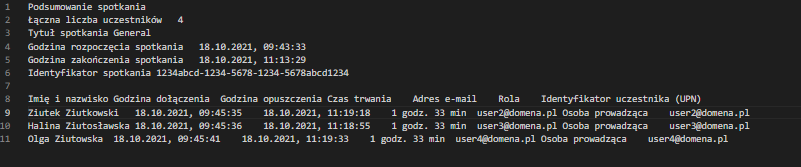
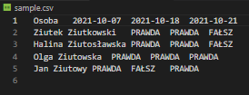

# MS Teams attendance statistics generator

A very raw command-line tool that generates a CSV file that sums up multiple attendance reports exported from Microsoft Teams. It's currently only capable of parsing MS Teams with Polish locale and I only tested it under Windows 10 (probably won't work on MacOS or Linux because the paths are written in a Windows-specific way). I might try to improve it when I find some time to procrastrinate.

Sample input:

Sample output:

